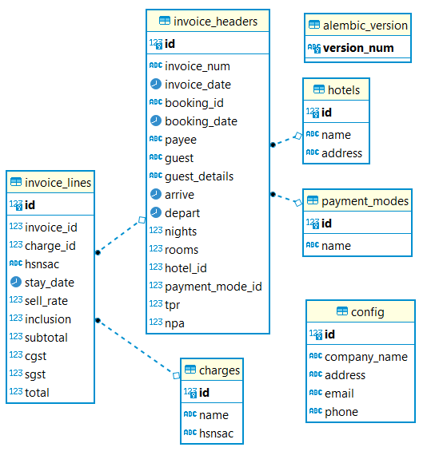

# MicroHMS

### Features
- Create Bookings, send Booking acknowledgements via email (Mailgun)
- Verify guests via 2FA (OTP on mobile) 
- Role based access to functionality (Admin/User)
- Create and manage billing entries
- Generate professional invoices via inbuilt template

### Getting Started
- Setup database (heroku-postgresql hobby-dev is a great free option)
- Add database URL to .env file (example provided)
- Setup a local environment
```bash
python3 -m venv env
source env/bin/activate
pip install -r requirements.txt
```
- Upgrade database to our model
```bash
flask db init
flask db migrate
flask db upgrade
```

- Create an Admin user and sample data
```bash
python3 -m quickstart
```
- Run your application
```
flask run
```

### Deployment
This can be deployed to heroku easily using the existing procfile
```bash
heroku git:remote -a yourappname
git push heroku main
```

### Some things to note
- Mailgun and MSG91 API's are used for Email and OTP respectively. These can be replaced by alternatives in project.util.py.
- Setup API keys in .env file as per need (The transactions will not fail if the API's fail, and that is by design.)
- Guest Registration / Booking page requires an OTP to verify the guest first, for testing purposes 1000 value will bypass this page. MAKE SURE TO REMOVE THIS LATER.




To be added in future releases
- Initialization script for easy setup
- Page to edit invoices
- Page to manage bookings

A sample application can be found here
https://microhms.herokuapp.com
